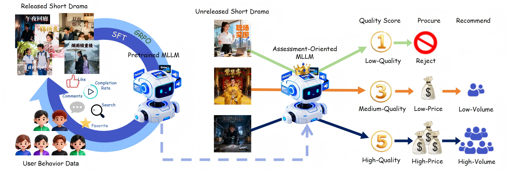
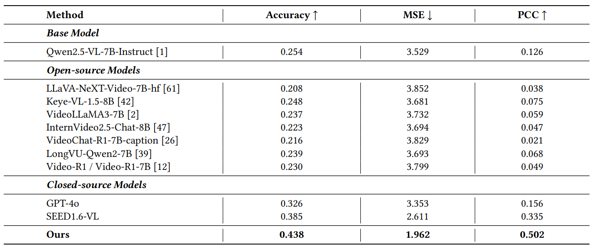

# Short-Drama Quality Assessment — Evaluation Set

------

## 🌟 Introduction



This repository releases the **evaluation set** for *Bridging Visual Dynamics and Reasoning Evaluation: Multimodal Large Language Models for Short Drama Quality Assessment*. This evaluation set targets the task of **short drama quality assessment**: given only the video of a short drama, predict a **discrete quality score (1–5)** that reflects both **visual presentation** and **narrative appeal** audience preference. It offers practical value in both content procurement and cold-start recommendation scenarios.

------

## 🛠️ Data Construction

### 1. Video

Videos are collected from [Hongguo](https://novelquickapp.com/) short-drama platform, spanning 26 genres and diverse release periods. We only include **early 5 episodes** for quality assessment.

### 2. Human-Centric Quality Score

We define a **hot value** derived from post-exposure user signals to measure the performance of a short drama. We normalize eight non-ratio indicators (i.e., *daily average watch time, daily average UV, favorites, likes, six-month cumulative watch time, six-month cumulative UV, comments,* and *search*) $x_i$, to a score $u_i$, in the range $[5, 100+)$, as defined below:

$$
u_i =
\begin{cases}
5 + 15 \dfrac{x_i - x_{\min}^i}{x_{p30}^i - x_{\min}^i}, & x_i < x_{p30}^i, \\\\
20 + 50 \dfrac{x_i - x_{p30}^i}{x_{p93}^i - x_{p30}^i}, & x_{p30}^i \le x_i < x_{p93}^i, \\\\
70 + 30 \dfrac{x_i - x_{p93}^i}{x_{10}^i - x_{p93}^i}, & x_i \ge x_{p93}^i.
\end{cases}
$$

Here, $x_i$, $x_{\min}^i$, $x_{p30}^i$, $x_{p93}^i$, and $x_{10}^i$ denote the raw value, minimum value, 30th percentile, 93rd percentile, and 10th-ranked value of the indicator, respectively. For the ratio indicator completion rate $x_9$, we apply a capped piecewise normalization to obtain its score $u_9$:

$$
u_9 =
\begin{cases}
100, & x_9 > 0.7, \\\\
3 + 12 \dfrac{x_9}{0.3}, & 0 \le x_9 < 0.3 \text{ or } x_9 \text{ is null}, \\\\
15 + 85 \dfrac{x_9 - 0.3}{0.4}, & 0.3 \le x_9 \le 0.7.
\end{cases}
$$

Here, $u_9$ is the normalized score for the completion rate $x_9$ with a range of $[3, 100]$. The hot value$H$is obtained by a weighted sum of the nine indicator scores, where $\lbrace w_i \rbrace_{i=1}^9$ are their corresponding weights:

$$
H = \sum_{i=1}^{9} w_i \cdot u_i, \quad \text{where } \sum_{i=1}^{9} w_i = 1.
$$

This unbounded design ensures that the hot value can scale with exceptionally high composite scores, accurately reflecting the popularity of viral dramas without an artificial ceiling. Since the distribution of this hot value has multiple modes, we use the K-means clustering method to map each short drama to a quality score from 1 to 5.

------

## 🏋️ Usage

The evaluation set is provided as a JSON file located at `data/release.json`.  
Each entry is a key–value pair with the following format:

- **Key**: a video URL (string), uniquely identifying a short drama.  
- **Value**: an integer quality score (1–5), reflecting the drama’s overall quality based on user engagement metrics.

Example format:

```json
{
  "<video_url_1>": <quality_score_1>,
  "<video_url_2>": <quality_score_2>,
  ...
}
```

To calculate evaluation metrics for your model, first convert your prediction results into the same JSON format as `release.json`, i.e.:

```json
{
  "<video_url_1>": <predicted_score_1>,
  "<video_url_2>": <predicted_score_2>,
  ...
}
```

Then run the evaluation script located at `evaluation/eval.py` using the following command:

```bash
python evaluation/eval.py --input_path1 YOUR_RESULT_JSON_PATH --input_path2 GT_JSON_PATH
```

- `YOUR_RESULT_JSON_PATH`: path to your prediction file  
- `GT_JSON_PATH`: path to the ground-truth file (e.g., `data/eval.json`)

------

## 🍭 Result





